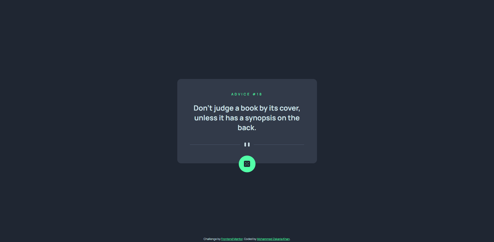
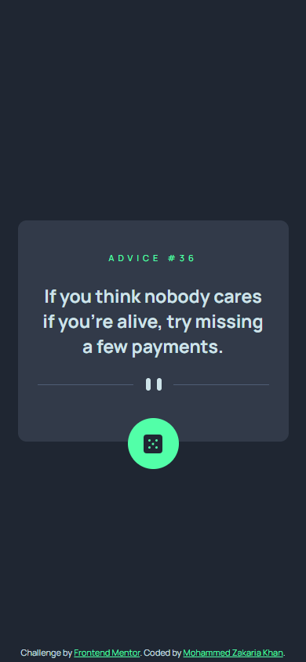

# Frontend Mentor - Advice generator app solution

This is a solution to the [Advice generator app challenge on Frontend Mentor](https://www.frontendmentor.io/challenges/advice-generator-app-QdUG-13db). Frontend Mentor challenges help you improve your coding skills by building realistic projects.

## Table of contents

-   [Overview](#overview)
    -   [The challenge](#the-challenge)
    -   [Desktop Screenshot](#desktop-screenshot)
    -   [Mobile Screenshot](#mobile-screenshot)
    -   [Links](#links)
-   [My process](#my-process)
    -   [Built with](#built-with)
    -   [What I learned](#what-i-learned)
    -   [Continued Development](#continued-development)
    -   [Useful resources](#useful-resources)
-   [Author](#author)

## Overview

### The challenge

Users should be able to:

-   View the optimal layout for the app depending on their device's screen size
-   See hover states for all interactive elements on the page
-   Generate a new piece of advice by clicking the dice icon

### Desktop Screenshot

### Mobile Screenshot

### Links

-   [Solution](https://github.com/zaks276/frontend-mentor-challenges/tree/main/advice-generator-app-main)
-   [Live Site](https://mzk-frontend-mentor-challenges.netlify.app/advice-generator-app-main)

## My process

### Built with

-   Semantic HTML5 markup
-   CSS custom properties
-   Flexbox
-   Mobile-first workflow
-   Javascript
-   Advice Slip API

### What I learned

While completing this project I learnt how to connect the frontend to an API by means of the Javascript Fetch API. I also learned about async functions, Javascript promises and how to process the response from the Fetch API with the `.json()` method. Lastly, I learned how execute a function on window load with the `addEventListener()` method.

### Continued development

For future projects I definitely want to play around with API's more. I also want to deepen my understanding of asynchronous functions and Javascript promises.

### Useful resources

-   [The Modern JavaScript Tutorial](https://www.javascript.info) - A helpful resource for all things Javascript.
-   [JavaScript Fetch API](https://www.w3schools.com/jsref/api_fetch.asp) - A basic introduction to the modern Javascript Fetch API.
-   [MDN Docs Response.json()](https://developer.mozilla.org/en-US/docs/Web/API/Response/json) - Great documentation for a very useful method of the Fetch API response interface.

## Author

-   Frontend Mentor - [@zaks276](https://www.frontendmentor.io/profile/zaks276)
