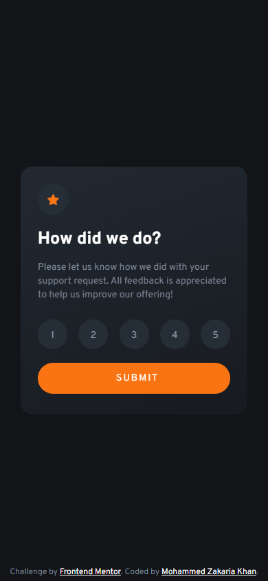
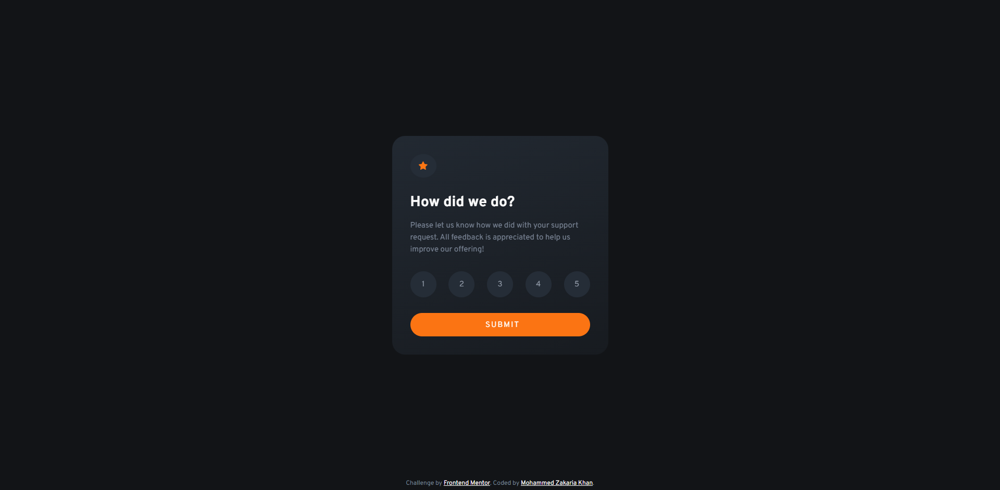
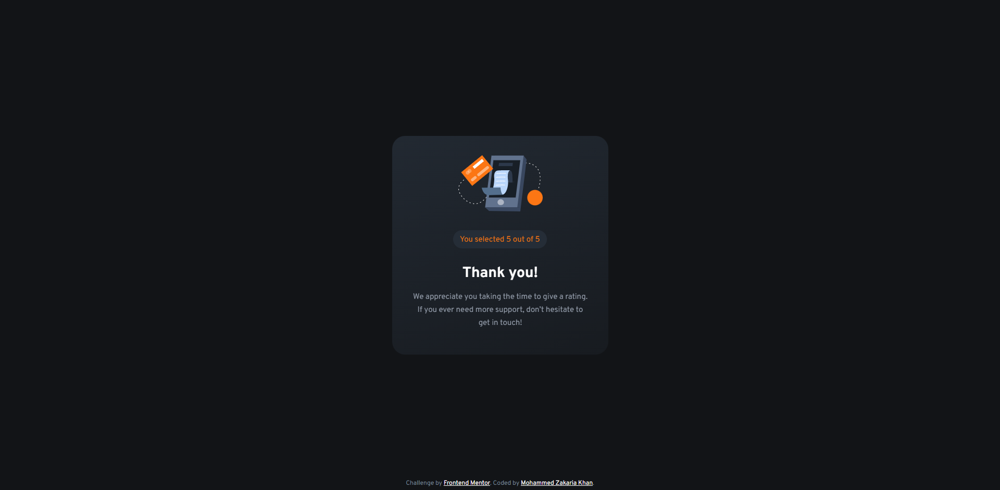

# Frontend Mentor - Interactive rating component solution

This is a solution to the [Interactive rating component challenge on Frontend Mentor](https://www.frontendmentor.io/challenges/interactive-rating-component-koxpeBUmI). Frontend Mentor challenges help you improve your coding skills by building realistic projects.

## Table of contents

-   [Overview](#overview)
    -   [The challenge](#the-challenge)
    -   [Mobile Screenshots](#mobile-screenshots)
    -   [Desktop Screenshots](#desktop-screenshots)
    -   [Links](#links)
-   [My process](#my-process)
    -   [Built with](#built-with)
    -   [What I learned](#what-i-learned)
    -   [Useful resources](#useful-resources)
-   [Author](#author)

## Overview

### The challenge

Users should be able to:

-   View the optimal layout for the app depending on their device's screen size
-   See hover states for all interactive elements on the page
-   Select and submit a number rating
-   See the "Thank you" card state after submitting a rating

### Moblie Screenshots

### Desktop Screenshots

### Links

-   [Solution](https://your-solution-url.com)
-   [Live Site](https://your-live-site-url.com)

## My process

### Built with

-   Semantic HTML5 markup
-   CSS custom properties
-   Flexbox
-   Mobile-first workflow
-   Javascript

### What I learned

During this project I learned all about radio buttons, namely how to style them and how to process their inputs. I also played around with some animation. I implemented some button transition animations and a flip animation on displaying the thank you block. I used the `translateY()` CSS function together with the `:hover` selector for the radio button transition animations. I used a combination of the `::before`, `::after` and `:hover` selectors together with the `translate()` CSS function to implement the sumbit button transition animation. Lastly, I used the `@keyframes` rule and the `rotateY()` CSS function for the thank you block animation.

### Useful resources

-   [CSS Animation - Button with Sliding Background](https://codepen.io/Chen0682/pen/Rveoom) - This guide thought me how to implement the submit button transition
-   [CSS Animations](https://www.w3schools.com/css/css3_animations.asp) - This is a helpful and simple introduction into CSS Animation.
-   [How To Create a Flip Card With CSS](https://www.w3schools.com/howto/howto_css_flip_card.asp) - This guide was the inspiration for my flip animation on the rating submission.

## Author

-   Frontend Mentor - [@zaks276](https://www.frontendmentor.io/profile/zaks276)
