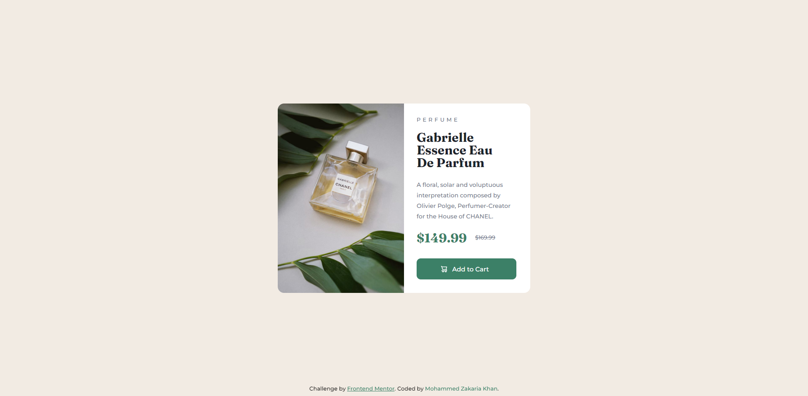

# Frontend Mentor - Product preview card component solution

This is a solution to the [Product preview card component challenge on Frontend Mentor](https://www.frontendmentor.io/challenges/product-preview-card-component-GO7UmttRfa). Frontend Mentor challenges help you improve your coding skills by building realistic projects.

## Table of contents
-   [Desktop screenshot](#desktop-screenshot)
-   [Mobile screenshot](#mobile-screenshot)
-   [Links](#links)
-   [Built with](#built-with)
-   [Author](#author)

## Desktop screenshot

## Mobile screenshot

## Links

-   Solution URL: [Add solution URL here](https://github.com/zaks276/frontend-mentor-challenges/tree/main/product-preview-card-component-main)
-   Live Site URL: [Add live site URL here](https://your-live-site-url.com)

## Built with

-   Semantic HTML5 markup
-   CSS custom properties
-   Flexbox
-   Mobile responsive design

## Author
-   Frontend Mentor - [@zaks276](https://www.frontendmentor.io/profile/zaks276)
