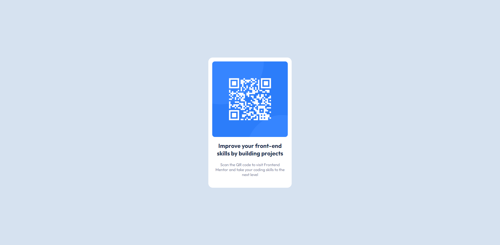

# Frontend Mentor - QR code component solution

This is a solution to the [QR code component challenge on Frontend Mentor](https://www.frontendmentor.io/challenges/qr-code-component-iux_sIO_H). Frontend Mentor challenges help you improve your coding skills by building realistic projects.

## Table of contents
-   [Screenshot](#screenshot)
-   [Links](#links)
-   [Built with](#built-with)
-   [Author](#author)

## Screenshot

## Links

-   [Solution](https://github.com/zaks276/frontend-mentor-challenges/tree/main/qr-code-component-main)
-   [Live Site](https://mzk-frontend-mentor-challenges.netlify.app/qr-code-component-main/)

## Built with

-   Semantic HTML5 markup
-   CSS custom properties
-   Flexbox

## Author

-   Frontend Mentor - [@zaks276](https://www.frontendmentor.io/profile/zaks276)
