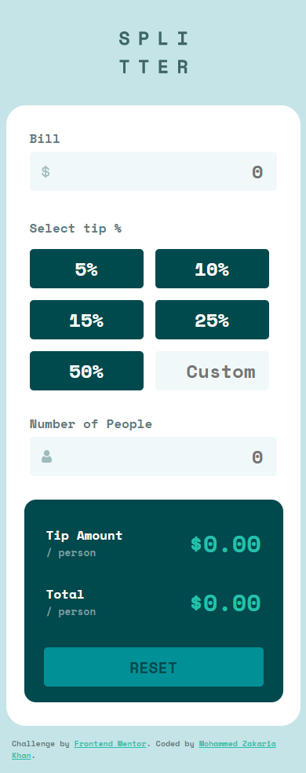
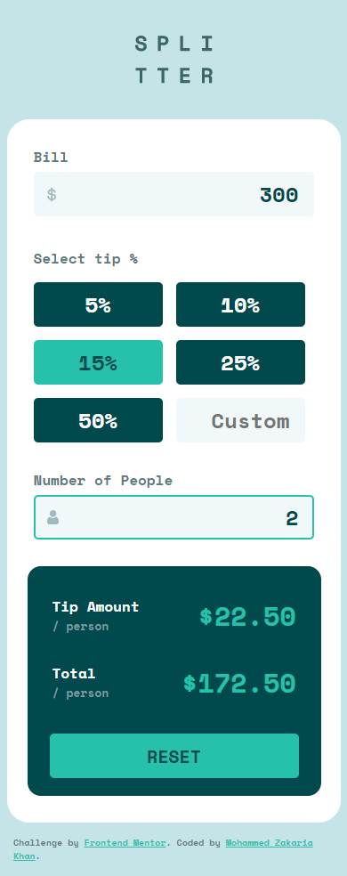
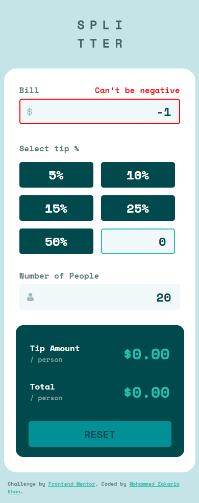
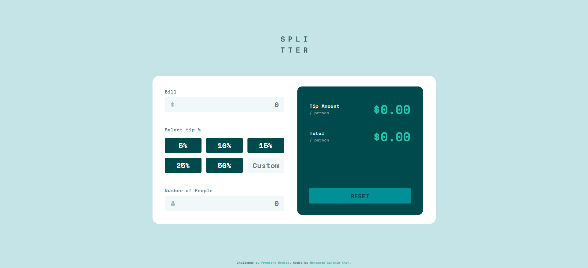
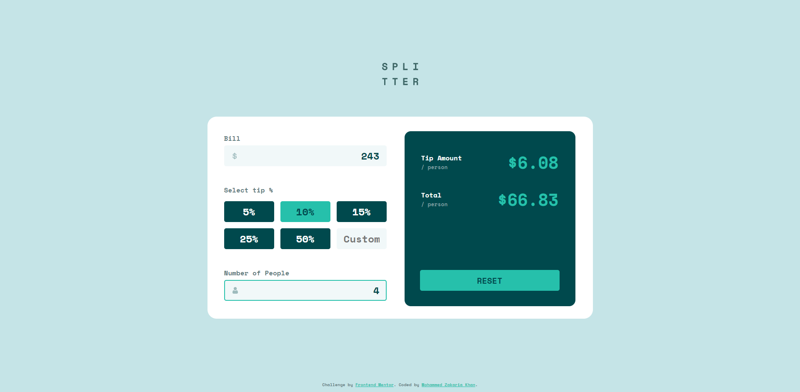
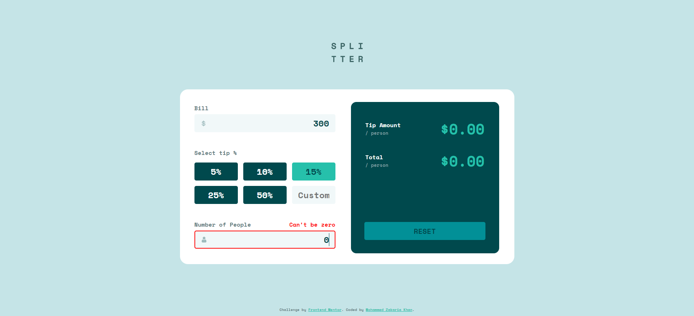

# Frontend Mentor - Tip calculator app solution

This is a solution to the [Tip calculator app challenge on Frontend Mentor](https://www.frontendmentor.io/challenges/tip-calculator-app-ugJNGbJUX). Frontend Mentor challenges help you improve your coding skills by building realistic projects.

## Table of contents

-   [Overview](#overview)
    -   [The challenge](#the-challenge)
    -   [Mobile Screenshots](#mobile-screenshots)
    -   [Desktop Screenshots](#desktop-screenshots)
    -   [Links](#links)
-   [My process](#my-process)
    -   [Built with](#built-with)
    -   [Useful resources](#useful-resources)
-   [Author](#author)

## Overview

### The challenge

Users should be able to:

-   View the optimal layout for the app depending on their device's screen size
-   See hover states for all interactive elements on the page
-   Calculate the correct tip and total cost of the bill per person

### Mobile Screenshots

### Desktop Screenshots

### Links

-   [Solution](https://your-solution-url.com)
-   [Live Site](https://your-live-site-url.com)

## My process

### Built with

-   Semantic HTML5 markup
-   CSS custom properties
-   Flexbox
-   CSS Grid
-   Mobile-first workflow
-   Javascript

### Useful resources

-   [MDN](https://developer.mozilla.org/en-US/)
-   [W3Shools](https://www.w3schools.com/)
-   [Stack Overflow](https://stackoverflow.com/)

## Author

-   Frontend Mentor - [@zaks276](https://www.frontendmentor.io/profile/zaks276)
